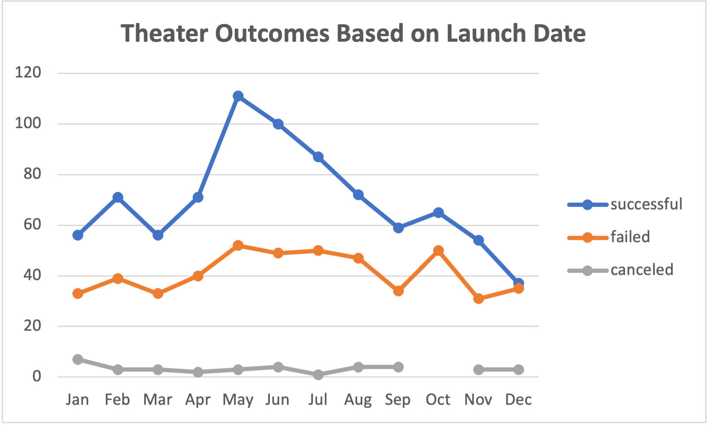
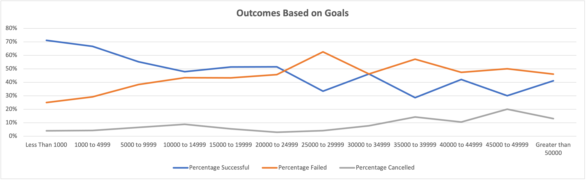

# An Analysis of Kickstarter Campaigns

## Overview of Project

### Purpose
 
Louise created a file to track her project campaign. The file contains thousands of crowdfunding projects. I will provide her key data insights, and visualize different trends. I will analyze the kickstarter data to see if her kickstarter outcomes are correlated with the launch date and to discover trends with the outcomes based on goals. Below are visualizations of my findings.
 
## Analysis and Challenges

### Analysis of Outcomes Based on Launch Date

### Analysis of Outcomes Based on Goals

### Challenges and Difficulties Encountered
At one point in my analysis I created a table that contained descriptive statistics of the goal and pledged amounts. When I first organized the data, I created a pivot table. When I created the pivot table, I ended up with the incorrect mean, median, standard deviation, upper quartile, lower quartile, and IQR for the goal and pledged amounts. I found it was simpler and faster to incorporate two filters the kickstarter sheet. Furthermore, the result of using filters instead of a pviot table was the correct mean, median, standard deviation, upper quartile, lower quartile, and IQR for the goal and pledged amounts. In conclusion, I needed to keep my process simple, and I am more comfortable with filters than pivot charts.

## Results
Two conclusions regarding the Theater Outcomes by Launch Date are that the most successful kickstarts for theater occurs in May, and the lowest occurs in December. Thus, Louise should have more kickstarters in May, and fewer in December. 

Two conclusions regarding the Outcomes based on Goals are that over 40% of goal outcomes failed when the goal was $20,000+ and around 50% or more succeeded when the goal was less than $20,000 or less. Including, goals less than $1000 succeeded over 70%, while goals at $45,000+ failed on average 15% of the time. Thus, Louise should have more goals below $20,000 for the most successful results.

The kickstarter campaign dataset is limited in that we do not know why outomces resulted in cancellations or failures. There could be more structural issues that are not represented in the dataset. With this data available, we could find other trends to help Louise make adjustments, and have more successful outcomes.

What are some other possible tables and/or graphs that we could create? Another graph/table we could create would be an Outcomes by Country. This graph could help us understand trends within countries to discover which countries have the most failures or cancellations. Additionally, we could include the subcategory in the a pivot table to see if certain countries have preferences of different subcategories.
